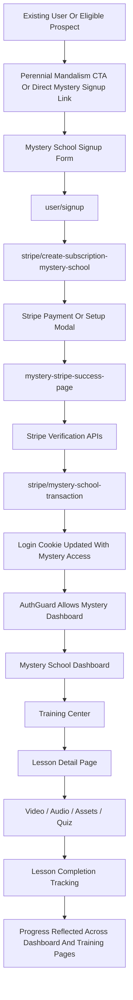
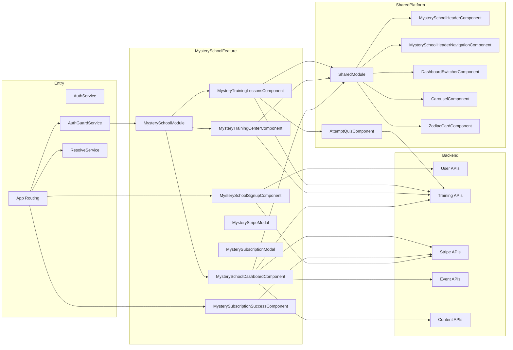
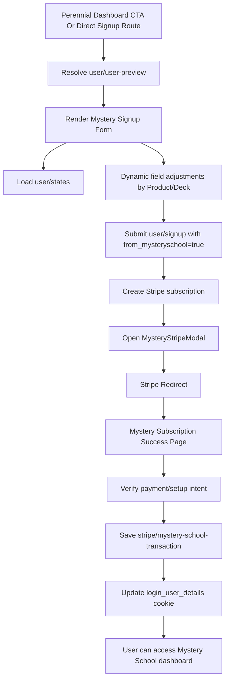
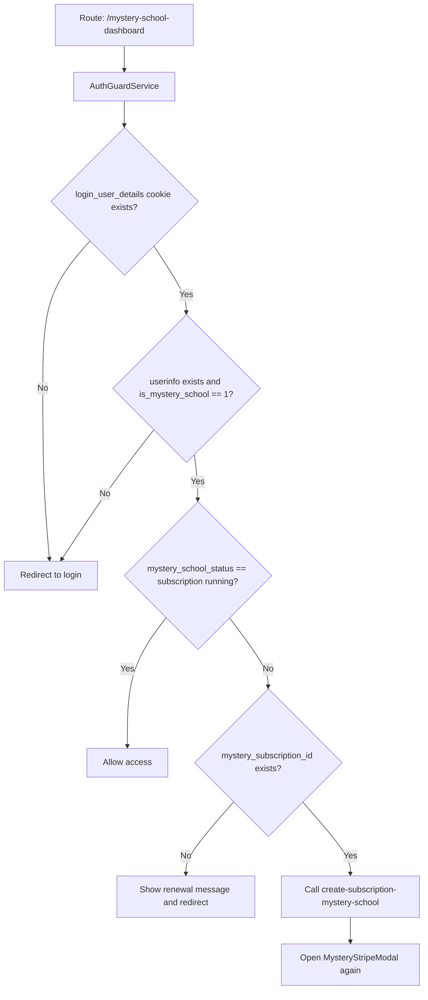
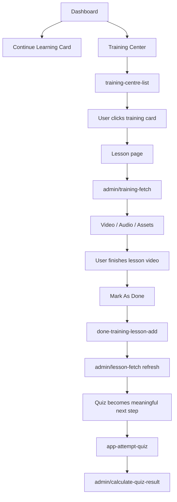
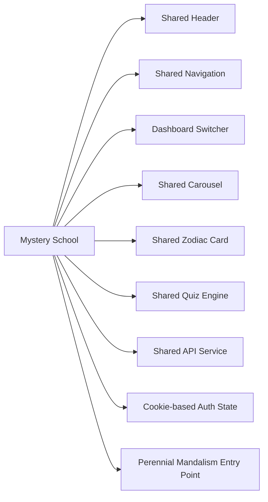

# Mystery School Module Walkthrough Report

## 1. Purpose Of This Report

This document explains the full Mystery School implementation in the project in a way that works for both:

- non-technical stakeholders who want to understand the user journey, business significance, and what is already built
- technical stakeholders who need the architecture, file map, module relationships, and API usage details

This report covers:

- end-to-end user flow
- module significance
- architectural process flow
- inter-related modules and dependencies
- screen-by-screen walkthrough
- full Mystery School API inventory used in the frontend
- implementation status, strengths, and notable gaps

---

## 2. Executive Summary

The Mystery School module is a paid, gated learning experience inside the Angular application. It combines:

- membership onboarding
- subscription payment via Stripe
- guarded dashboard access
- guided training progression
- lesson playback
- lesson completion tracking
- quiz-based reinforcement
- downloadable learning assets

At a high level, the module works like this:

1. A user is invited or routed into Mystery School signup.
2. The user completes a long-form signup and intake form.
3. The app creates or updates the user record.
4. The app starts a Stripe Mystery School subscription flow.
5. On successful payment/setup, the app writes subscription data into the backend and updates the login cookie.
6. The user can then access the Mystery School dashboard.
7. The dashboard points the user to the next lesson and the Wheel of the Year progression.
8. The training center lists available initial trainings.
9. A lesson page provides video, audio, assets, and quiz access.
10. Lesson progress is tracked and reflected back across the module.

Business significance:

- this is the frontend entry point for Mystery School monetization
- this is also the user education and retention path for subscribed members
- it is connected to broader platform identity, account state, and cross-dashboard switching

---

## 3. What Mystery School Means In The Product

Mystery School is positioned as a premium spiritual learning program inside the broader Divine Infinite Being platform.

It currently supports these product goals:

- converting eligible users into paying Mystery School subscribers
- giving subscribed users a dedicated dashboard and training journey
- tracking user learning progress
- controlling access based on subscription state
- connecting learning to the broader platform account system

The module is not isolated from the rest of the platform. It is tightly connected to:

- login cookies
- shared headers/navigation
- cross-dashboard switching
- Stripe billing
- reusable training and quiz infrastructure
- generic backend APIs reused across other modules

---

## 4. User-Friendly Architecture Chart



---

## 5. Full Architectural Process Flow



---

## 6. Inter-Related Module Flow Charts

### 6.1 Signup And Subscription Flow



### 6.2 Authentication And Gated Access Flow



### 6.3 Learning Flow



### 6.4 Shared Platform Relationship Flow



---

## 7. Main User Journey Walkthrough

## 7.1 Entry Paths

The main ways a user reaches Mystery School are:

- the user already has Mystery School access and is routed there after login
- the user is invited through the Perennial Mandalism dashboard CTA
- the user directly opens the signup route

Relevant files:

- [src/app/services/auth.service.ts](/home/influxiq100/TIRTHAYAN/Active/DIVINE%20ANGULER%20FRONTEND/divine-infinite-being-angular-ui/src/app/services/auth.service.ts)
- [src/app/perennial-mandalism/perennial-mandalism-dashboard/perennial-mandalism-dashboard.component.ts](/home/influxiq100/TIRTHAYAN/Active/DIVINE%20ANGULER%20FRONTEND/divine-infinite-being-angular-ui/src/app/perennial-mandalism/perennial-mandalism-dashboard/perennial-mandalism-dashboard.component.ts)
- [src/app/app-routing.module.ts](/home/influxiq100/TIRTHAYAN/Active/DIVINE%20ANGULER%20FRONTEND/divine-infinite-being-angular-ui/src/app/app-routing.module.ts)

Significance:

- this is where Mystery School becomes part of the larger account ecosystem
- it is not a standalone app
- it depends on existing user identity and cookie state

## 7.2 Signup Experience

The signup form is long and intake-heavy. It collects:

- identity and contact information
- birth data
- state and city
- relationship and occupation context
- broad personal and spiritual self-description
- selected toolkit type
- selected product/deck
- context-specific extra questions based on the selected reading/tool

The form dynamically changes based on:

- `Product_Deck`
- `Product_Deck_name`

Examples:

- Weekly Transits adds a required week selector
- Monthly Transits + Lunar Return adds a required month selector
- relationship products add partner birth details
- Predictive Event (Horary) adds a required question field
- Tarot Toolkit swaps the available product/deck options

Significance:

- this is not just a billing form
- it doubles as intake/context collection for the user’s spiritual and educational journey

Relevant files:

- [src/app/mystery-school-signup/mystery-school-signup.component.ts](/home/influxiq100/TIRTHAYAN/Active/DIVINE%20ANGULER%20FRONTEND/divine-infinite-being-angular-ui/src/app/mystery-school-signup/mystery-school-signup.component.ts)
- [src/app/mystery-school-signup/mystery-school-signup.component.html](/home/influxiq100/TIRTHAYAN/Active/DIVINE%20ANGULER%20FRONTEND/divine-infinite-being-angular-ui/src/app/mystery-school-signup/mystery-school-signup.component.html)
- [src/assets/style.css](/home/influxiq100/TIRTHAYAN/Active/DIVINE%20ANGULER%20FRONTEND/divine-infinite-being-angular-ui/src/assets/style.css)

## 7.3 Subscription Start

After signup succeeds:

- the frontend shows a success snackbar
- it immediately calls the Mystery School Stripe subscription API
- it opens a Stripe modal

The same Stripe subscription creation flow is reused in:

- signup onboarding
- dashboard manual subscribe
- AuthGuard auto-reactivation when access exists but subscription is not running

Significance:

- subscription logic is centralized by API endpoint, not by a dedicated frontend service
- this reuse reduces duplicated payment setup logic

## 7.4 Stripe Return And Subscription Finalization

After Stripe redirects back:

- the app reads `payment_intent` or `setup_intent` from the URL
- it calls backend verification endpoints
- it posts a transaction record to the backend
- on success it updates the main login cookie with active Mystery School flags

The updated cookie fields include:

- `is_mystery_school`
- `mystery_subscription_status`
- `mystery_school_status`
- `mystery_subscription_id`
- `mystery_current_period_end`

Significance:

- the cookie is the main frontend access-control source
- subscription success is not just visual; it directly affects authorization

## 7.5 AuthGuarded Access

The Mystery School dashboard route is protected by custom logic.

The guard checks:

- the login cookie exists
- cookie JSON is valid
- `userinfo` exists
- `is_mystery_school == 1`
- `mystery_school_status == 'subscription running'`

If the user has a Mystery subscription ID but the status is not running:

- the app tries to restart the subscription flow automatically

If the user does not have the required membership flag:

- the app deletes cookies and redirects to login

Significance:

- frontend gating is heavily cookie-driven
- membership and billing state are strongly tied together

## 7.6 Dashboard Experience

The currently active Mystery School dashboard UI includes:

- shared Mystery header
- shared Mystery navigation
- a “Continue Learning” block
- training progress percentage
- a direct “Go to Lesson” CTA
- a zodiac-style Wheel of the Year section

The dashboard uses resolver data from the training percentage API to show:

- current completion percentage
- next training name
- next lesson name
- next training ID

There is also a larger older dashboard implementation still present in the file. That older version includes:

- event slot cards
- resource library cards
- content counts
- slot subscription/unsubscription

Much of that older HTML is commented out, but the TypeScript methods still exist.

Significance:

- the dashboard has an active simplified version
- it also contains partially retained code from a richer earlier design

## 7.7 Training Center

The training center is the structured learning entry point.

It shows:

- overall training progress
- an “Initial Training” banner
- a shared carousel of training cards

The carousel is populated from the backend with Mystery-role-specific training items.

When the user clicks a training card:

- they are routed to the lesson page for that training

Significance:

- this screen is the bridge between top-level dashboard awareness and actual lesson consumption

## 7.8 Lesson Detail Page

The lesson page fetches the selected training category and renders:

- category name and description
- video lessons
- audio meditations
- lesson content
- downloadable resources
- knowledge check entry point

Important progression logic:

- when a video ends, `showMarkAsDone` becomes true
- the user can then click “Mark as Done”
- the app records completion in the backend
- the app refreshes lesson state using `admin/lesson-fetch`

Significance:

- this is where Mystery School shifts from dashboard experience to actual education workflow

## 7.9 Quiz Flow

Mystery School does not have a unique quiz engine.

Instead, the lesson modal uses:

- `app-attempt-quiz`

This component comes from the shared astrologer training-center module.

The quiz engine:

- fetches the current quiz question
- stores prior answers
- lets users move next or previous
- evaluates correctness
- can emit quiz completion

Significance:

- Mystery School is reusing an existing learning/assessment system
- that reduces duplication but also creates cross-module coupling

## 7.10 Asset Access

Lesson assets are presented in a modal and downloaded/opened from S3.

Asset URLs are built from:

- `asset.baseurl`
- `asset.fileservername`

Significance:

- frontend assumes assets are already uploaded and available in S3
- there is no custom file service just for Mystery School

---

## 8. Business Significance By Submodule

| Submodule | Business Role | Why It Matters |
|---|---|---|
| Signup | onboarding and data capture | converts eligible users into Mystery School prospects and gathers intake context |
| Stripe flow | payment activation | turns a prospect into a paying member |
| Success page | subscription finalization | ensures payment results become actual user access |
| AuthGuard | access governance | prevents non-members or expired members from entering |
| Dashboard | orientation and retention | gives members a clear next step and sense of progress |
| Training Center | structured curriculum discovery | organizes available learning content |
| Lesson page | actual learning delivery | where users consume value |
| Quiz engine | reinforcement and validation | supports educational depth and progression |
| Shared header/navigation | ecosystem consistency | keeps Mystery School integrated with the wider platform |
| Dashboard switcher | multi-program account management | supports users with access to multiple platform experiences |

---

## 9. Primary Files And Their Responsibilities

### 9.1 Routing, Module Wiring, And Access Control

| File | Responsibility |
|---|---|
| [src/app/app-routing.module.ts](/home/influxiq100/TIRTHAYAN/Active/DIVINE%20ANGULER%20FRONTEND/divine-infinite-being-angular-ui/src/app/app-routing.module.ts) | declares Mystery School lazy route, signup route, and success route |
| [src/app/mystery-school/mystery-school-routing.module.ts](/home/influxiq100/TIRTHAYAN/Active/DIVINE%20ANGULER%20FRONTEND/divine-infinite-being-angular-ui/src/app/mystery-school/mystery-school-routing.module.ts) | defines dashboard, training center, and lesson child routes |
| [src/app/mystery-school/mystery-school.module.ts](/home/influxiq100/TIRTHAYAN/Active/DIVINE%20ANGULER%20FRONTEND/divine-infinite-being-angular-ui/src/app/mystery-school/mystery-school.module.ts) | feature module declarations/imports |
| [src/app/services/auth-guard.service.ts](/home/influxiq100/TIRTHAYAN/Active/DIVINE%20ANGULER%20FRONTEND/divine-infinite-being-angular-ui/src/app/services/auth-guard.service.ts) | Mystery School route authorization and subscription restart handling |
| [src/app/services/auth.service.ts](/home/influxiq100/TIRTHAYAN/Active/DIVINE%20ANGULER%20FRONTEND/divine-infinite-being-angular-ui/src/app/services/auth.service.ts) | post-login navigation logic and membership checks |
| [src/app/services/resolve.service.ts](/home/influxiq100/TIRTHAYAN/Active/DIVINE%20ANGULER%20FRONTEND/divine-infinite-being-angular-ui/src/app/services/resolve.service.ts) | injects `user_id` or route params into API request conditions |

### 9.2 Mystery School Screens

| File | Responsibility |
|---|---|
| [src/app/mystery-school/mystery-school-dashboard/mystery-school-dashboard.component.ts](/home/influxiq100/TIRTHAYAN/Active/DIVINE%20ANGULER%20FRONTEND/divine-infinite-being-angular-ui/src/app/mystery-school/mystery-school-dashboard/mystery-school-dashboard.component.ts) | main dashboard logic, subscription modal hooks, event slot code, resource count code |
| [src/app/mystery-school/mystery-school-dashboard/mystery-school-dashboard.component.html](/home/influxiq100/TIRTHAYAN/Active/DIVINE%20ANGULER%20FRONTEND/divine-infinite-being-angular-ui/src/app/mystery-school/mystery-school-dashboard/mystery-school-dashboard.component.html) | active dashboard UI plus older commented dashboard markup |
| [src/app/mystery-school/mystery-training-center/mystery-training-center.component.ts](/home/influxiq100/TIRTHAYAN/Active/DIVINE%20ANGULER%20FRONTEND/divine-infinite-being-angular-ui/src/app/mystery-school/mystery-training-center/mystery-training-center.component.ts) | progress and training carousel loading |
| [src/app/mystery-school/mystery-training-lessons/mystery-training-lessons.component.ts](/home/influxiq100/TIRTHAYAN/Active/DIVINE%20ANGULER%20FRONTEND/divine-infinite-being-angular-ui/src/app/mystery-school/mystery-training-lessons/mystery-training-lessons.component.ts) | lesson fetch, playback, completion, quiz modal, assets modal |
| [src/app/mystery-school-signup/mystery-school-signup.component.ts](/home/influxiq100/TIRTHAYAN/Active/DIVINE%20ANGULER%20FRONTEND/divine-infinite-being-angular-ui/src/app/mystery-school-signup/mystery-school-signup.component.ts) | signup intake form, dynamic field logic, onboarding payment trigger |
| [src/app/mystery-subscription-success/mystery-subscription-success.component.ts](/home/influxiq100/TIRTHAYAN/Active/DIVINE%20ANGULER%20FRONTEND/divine-infinite-being-angular-ui/src/app/mystery-subscription-success/mystery-subscription-success.component.ts) | Stripe return processing and cookie update |

### 9.3 Shared Dependencies

| File | Responsibility |
|---|---|
| [src/app/shared/shared.module.ts](/home/influxiq100/TIRTHAYAN/Active/DIVINE%20ANGULER%20FRONTEND/divine-infinite-being-angular-ui/src/app/shared/shared.module.ts) | exports Mystery School header, nav, carousel, zodiac card, dashboard switcher |
| [src/app/layout/mystery-school-header/mystery-school-header.component.ts](/home/influxiq100/TIRTHAYAN/Active/DIVINE%20ANGULER%20FRONTEND/divine-infinite-being-angular-ui/src/app/layout/mystery-school-header/mystery-school-header.component.ts) | top bar, user menu, logout, my account |
| [src/app/layout/mystery-school-header-navigation/mystery-school-header-navigation.component.ts](/home/influxiq100/TIRTHAYAN/Active/DIVINE%20ANGULER%20FRONTEND/divine-infinite-being-angular-ui/src/app/layout/mystery-school-header-navigation/mystery-school-header-navigation.component.ts) | Mystery nav between dashboard and training center |
| [src/app/common-components/carousel/carousel.component.ts](/home/influxiq100/TIRTHAYAN/Active/DIVINE%20ANGULER%20FRONTEND/divine-infinite-being-angular-ui/src/app/common-components/carousel/carousel.component.ts) | generic card carousel used by training center |
| [src/app/common-components/zodiac-card/zodiac-card.component.ts](/home/influxiq100/TIRTHAYAN/Active/DIVINE%20ANGULER%20FRONTEND/divine-infinite-being-angular-ui/src/app/common-components/zodiac-card/zodiac-card.component.ts) | zodiac card rendering for Wheel of the Year |
| [src/app/common-components/dashboard-switcher/dashboard-switcher.component.ts](/home/influxiq100/TIRTHAYAN/Active/DIVINE%20ANGULER%20FRONTEND/divine-infinite-being-angular-ui/src/app/common-components/dashboard-switcher/dashboard-switcher.component.ts) | multi-dashboard switching, includes Mystery School option |
| [src/app/astrologer-dashboard/training-center/attempt-quiz/attempt-quiz.component.ts](/home/influxiq100/TIRTHAYAN/Active/DIVINE%20ANGULER%20FRONTEND/divine-infinite-being-angular-ui/src/app/astrologer-dashboard/training-center/attempt-quiz/attempt-quiz.component.ts) | shared quiz runner reused by Mystery School |

---

## 10. API Catalog

All calls below use the shared API layer in:

- [src/app/services/apiservices.service.ts](/home/influxiq100/TIRTHAYAN/Active/DIVINE%20ANGULER%20FRONTEND/divine-infinite-being-angular-ui/src/app/services/apiservices.service.ts)

Production base URL:

- `https://api.divineinfinitebeing.com/`

### 10.1 Core Access And Signup APIs

| Method | Route | Full URL | Where Called | Purpose |
|---|---|---|---|---|
| `GET` | `user/states` | `https://api.divineinfinitebeing.com/user/states` | signup component | populates state dropdown |
| `POST` | `user/user-preview` | `https://api.divineinfinitebeing.com/user/user-preview` | signup route resolver | preloads existing user info |
| `POST` | `user/signup` | `https://api.divineinfinitebeing.com/user/signup` | signup component | creates or updates Mystery School user intake record |
| `POST` | `stripe/create-subscription-mystery-school` | `https://api.divineinfinitebeing.com/stripe/create-subscription-mystery-school` | signup, dashboard, AuthGuard | starts or restarts subscription flow |
| `GET` | `stripe/payment-complete?payment_intent=...` | `https://api.divineinfinitebeing.com/stripe/payment-complete?...` | success page | verifies PaymentIntent |
| `GET` | `stripe/default-setup-complete?payment_intent=...` | `https://api.divineinfinitebeing.com/stripe/default-setup-complete?...` | success page | verifies SetupIntent |
| `POST` | `stripe/mystery-school-transaction` | `https://api.divineinfinitebeing.com/stripe/mystery-school-transaction` | success page | stores final billing transaction |
| `POST` | `stripe/unsubscribe-stripe-mystery` | `https://api.divineinfinitebeing.com/stripe/unsubscribe-stripe-mystery` | dashboard unsubscribe modal | cancels subscription |
| `GET` | `user/logout/:username` | `https://api.divineinfinitebeing.com/user/logout/:username` | Mystery header | logs user out |

### 10.2 Training And Progress APIs

| Method | Route | Full URL | Where Called | Purpose |
|---|---|---|---|---|
| `POST` | `training-centre/training-report-percentage` | `https://api.divineinfinitebeing.com/training-centre/training-report-percentage` | dashboard/training resolver | returns progress and next lesson context |
| `POST` | `training-centre/training-centre-list` | `https://api.divineinfinitebeing.com/training-centre/training-centre-list` | training center | returns available training cards |
| `POST` | `admin/training-fetch` | `https://api.divineinfinitebeing.com/admin/training-fetch` | lesson page | fetches selected training and lesson data |
| `POST` | `training-centre/done-training-lesson-add` | `https://api.divineinfinitebeing.com/training-centre/done-training-lesson-add` | lesson page | marks a lesson as completed |
| `POST` | `admin/lesson-fetch` | `https://api.divineinfinitebeing.com/admin/lesson-fetch` | lesson page | refreshes one lesson after completion |
| `POST` | `admin/calculate-quiz-result` | `https://api.divineinfinitebeing.com/admin/calculate-quiz-result` | shared quiz engine | loads quiz questions and evaluates answers |

### 10.3 Additional Dashboard APIs Present In Code

| Method | Route | Full URL | Where Called | Purpose |
|---|---|---|---|---|
| `POST` | `event/available-event-slot-list` | `https://api.divineinfinitebeing.com/event/available-event-slot-list` | dashboard TS | loads available event slots |
| `POST` | `event/event-subscription` | `https://api.divineinfinitebeing.com/event/event-subscription` | slot subscription modal | subscribe/unsubscribe event notifications |
| `GET` | `content/content-type-counts` | `https://api.divineinfinitebeing.com/content/content-type-counts` | dashboard TS | returns content counts for resource library cards |

---

## 11. API Details With Payloads And Response Usage

## 11.1 `GET user/states`

**URL**

`https://api.divineinfinitebeing.com/user/states`

**Used In**

- Mystery signup page

**How It Is Called**

- called on `ngOnInit()` to build the state dropdown

**Request Payload**

- none

**Response Structure Used By Frontend**

```json
{
  "results": {
    "res": [
      {
        "abbreviation": "GA",
        "name": "Georgia"
      }
    ]
  }
}
```

**Frontend Usage**

- maps each result into `{ val, name }` for a select control

---

## 11.2 `POST user/user-preview`

**URL**

`https://api.divineinfinitebeing.com/user/user-preview`

**Used In**

- signup route resolver

**How It Is Called**

- resolver injects `_id` from `/mysteryschool-signup/:_id`

**Request Payload**

```json
{
  "_id": "USER_ID"
}
```

**Response Structure Used By Frontend**

```json
{
  "status": "success",
  "res": {
    "_id": "USER_ID",
    "email": "user@example.com"
  }
}
```

**Frontend Usage**

- pre-fills editable form values
- stores `_id` for update path
- locks the email field when email already exists

---

## 11.3 `POST user/signup`

**URL**

`https://api.divineinfinitebeing.com/user/signup`

**Used In**

- Mystery School signup submission

**How It Is Called**

- after the dynamic intake form validates and optional-field confirmation is complete

**Request Payload**

Representative payload:

```json
{
  "_id": "USER_ID_IF_UPDATE",
  "email": "user@example.com",
  "firstname": "Jane",
  "lastname": "Doe",
  "phone": "1234567890",
  "dob": "1990-01-01",
  "time_of_birth": "13:30",
  "state": "GA",
  "city": "Atlanta",
  "zip": "30000",
  "gender": "female",
  "occupation": "Teacher",
  "relationship_status": "single",
  "address": "Street address",
  "additional_info": "More about yourself",
  "Product_Deck": "Astro Toolkit",
  "Product_Deck_name": "Nativity Birth Chart",
  "describe_your_personality": "....",
  "primary_sengths_talents": "....",
  "life_areas_currently_fulfilling": "....",
  "life_areas_needing_improvement": "....",
  "long_term_goals_and_aspirations": "....",
  "major_life_events_experiences": "....",
  "stress_management": true,
  "Work_Life_balance": false,
  "current_relationship_with_family_and_friends": "....",
  "focus_on_specific_relationships": false,
  "concerns_about_romantic_life": false,
  "social_life_fulfillment": true,
  "biggest_current_challenges": "....",
  "guidance_on_specific_decision": true,
  "ongoing_projects": true,
  "achieve_from_the_reading": "....",
  "specific_questions_topics_to_address": false,
  "goals_or_outcomes_for_the_reading": true,
  "Preference_for_practical_advice_vs_spiritual_insights": false,
  "spiritual_or_personal_growth_practices": true,
  "exploring_self_discovery": true,
  "belief_in_external_influences_on_life": true,
  "main_concern_or_question_right_now": "....",
  "anything_else_to_share": "....",
  "concerns_reservations_about_the_consultation": false,
  "from_mysteryschool": true
}
```

**Response Structure Used By Frontend**

```json
{
  "status": "success",
  "message": "..."
}
```

**Frontend Usage**

- shows response message
- immediately starts Stripe subscription creation after success

---

## 11.4 `POST stripe/create-subscription-mystery-school`

**URL**

`https://api.divineinfinitebeing.com/stripe/create-subscription-mystery-school`

**Used In**

- signup component
- dashboard subscribe action
- AuthGuard reactivation flow

**Request Payload**

```json
{
  "customer_email": "user@example.com",
  "user_id": "USER_ID"
}
```

**Response Structure Used By Frontend**

Inferred from usage:

```json
{
  "status": "success",
  "results": {
    "clientSecret": "pi_secret_or_client_secret",
    "setupIntentClientSecret": "seti_secret_optional",
    "customerId": "cus_xxx",
    "subscriptionId": "sub_xxx"
  }
}
```

**Frontend Usage**

- opens the shared `MysteryStripeModal`
- modal uses `clientSecret` or `setupIntentClientSecret`
- stores payment context in `mysteryStripeUserDetails` cookie before redirect

---

## 11.5 `GET stripe/payment-complete`

**URL**

`https://api.divineinfinitebeing.com/stripe/payment-complete?payment_intent=PAYMENT_INTENT_ID`

**Used In**

- Mystery subscription success page

**Request Payload**

- query parameter only

**Response Structure Used By Frontend**

```json
{
  "id": "pi_xxx",
  "status": "succeeded",
  "amount": 1000,
  "currency": "usd"
}
```

**Frontend Usage**

- detects payment success/processing/failure
- builds transaction payload
- posts transaction to backend

---

## 11.6 `GET stripe/default-setup-complete`

**URL**

`https://api.divineinfinitebeing.com/stripe/default-setup-complete?payment_intent=SETUP_INTENT_ID`

**Used In**

- Mystery subscription success page

**Request Payload**

- query parameter only

**Response Structure Used By Frontend**

```json
{
  "status": "succeeded"
}
```

**Frontend Usage**

- used for saved payment method/setup-only style flows
- still results in transaction persistence and cookie update

---

## 11.7 `POST stripe/mystery-school-transaction`

**URL**

`https://api.divineinfinitebeing.com/stripe/mystery-school-transaction`

**Used In**

- Mystery subscription success page

**Request Payload**

```json
{
  "payment_id": "pi_xxx_or_seti_xxx",
  "payment_status": "succeeded",
  "amount": 1000,
  "currency": "usd",
  "payment_process_details": {},
  "customer_id": "APP_USER_ID",
  "stripe_customer_id": "cus_xxx",
  "subscription_id": "sub_xxx",
  "email": "user@example.com",
  "transaction_type": "payment"
}
```

**Response Structure Used By Frontend**

```json
{
  "status": "success"
}
```

**Frontend Usage**

- if successful, updates login cookie with active Mystery School status

---

## 11.8 `POST training-centre/training-report-percentage`

**URL**

`https://api.divineinfinitebeing.com/training-centre/training-report-percentage`

**Used In**

- dashboard route resolver
- training center route resolver
- lesson route resolver

**Request Payload**

```json
{
  "role": "is_mystery_school",
  "user_id": "USER_ID"
}
```

**Response Structure Used By Frontend**

Inferred:

```json
{
  "status": "success",
  "results": {
    "res": {
      "percentage": 35,
      "next_training_id": "TRAINING_ID",
      "next_training_name": "Initial Training",
      "next_lesson_name": "Lesson Title"
    }
  }
}
```

**Frontend Usage**

- dashboard continue-learning block
- progress bars on dashboard, training center, lesson page

---

## 11.9 `POST training-centre/training-centre-list`

**URL**

`https://api.divineinfinitebeing.com/training-centre/training-centre-list`

**Used In**

- Mystery training center

**Request Payload**

```json
{
  "user_id": "USER_ID",
  "role": "is_mystery_school"
}
```

**Response Structure Used By Frontend**

Inferred:

```json
{
  "status": "success",
  "results": {
    "res": [
      {
        "_id": "TRAINING_ID",
        "title": "Ritual",
        "content": "The Core Ritual",
        "subcontent": "Learn the fundamental structure",
        "image": "..."
      }
    ]
  }
}
```

**Frontend Usage**

- populates the training carousel
- clicking a card navigates to the selected training lesson screen

---

## 11.10 `POST admin/training-fetch`

**URL**

`https://api.divineinfinitebeing.com/admin/training-fetch`

**Used In**

- Mystery lesson page

**Request Payload**

```json
{
  "_id": "TRAINING_ID"
}
```

**Response Structure Used By Frontend**

Inferred:

```json
{
  "status": "success",
  "res": {
    "_id": "TRAINING_ID",
    "category_name": "Initial Training",
    "description": "....",
    "lesson_data": [
      {
        "_id": "LESSON_ID",
        "category_id": "TRAINING_ID",
        "description": "....",
        "quiz_available_flag": true,
        "lesson_completed_flag": false,
        "video": [],
        "audio": [],
        "image": [],
        "assets": []
      }
    ]
  }
}
```

**Frontend Usage**

- renders lesson content
- initializes `isPlayingVideo` flags for each lesson

---

## 11.11 `POST training-centre/done-training-lesson-add`

**URL**

`https://api.divineinfinitebeing.com/training-centre/done-training-lesson-add`

**Used In**

- Mystery lesson page

**Request Payload**

```json
{
  "lesson_id": "LESSON_ID",
  "user_id": "USER_ID",
  "training_id": "TRAINING_ID"
}
```

**Response Structure Used By Frontend**

- success/failure only is required by the current UI

**Frontend Usage**

- marks a lesson as done
- then immediately fetches the refreshed lesson state

---

## 11.12 `POST admin/lesson-fetch`

**URL**

`https://api.divineinfinitebeing.com/admin/lesson-fetch`

**Used In**

- Mystery lesson page after marking a lesson done

**Request Payload**

```json
{
  "_id": "LESSON_ID",
  "user_id": "USER_ID"
}
```

**Response Structure Used By Frontend**

```json
{
  "res": {
    "_id": "LESSON_ID",
    "lesson_completed_flag": true
  }
}
```

**Frontend Usage**

- replaces the updated lesson object inside `trainingData.lesson_data`

---

## 11.13 `POST admin/calculate-quiz-result`

**URL**

`https://api.divineinfinitebeing.com/admin/calculate-quiz-result`

**Used In**

- shared `app-attempt-quiz` inside Mystery quiz modal

**Initial Request Payload**

```json
{
  "lesson_id": "LESSON_ID",
  "training_id": "TRAINING_ID",
  "user_id": "USER_ID"
}
```

**Navigation / Answer Payload**

```json
{
  "lesson_id": "LESSON_ID",
  "training_id": "TRAINING_ID",
  "user_id": "USER_ID",
  "skip": 1,
  "selected_answer": {},
  "quiz_id": "QUIZ_ID",
  "previous": false,
  "is_disableQuiz": false
}
```

**Response Structure Used By Frontend**

Inferred:

```json
{
  "status": "success",
  "results": {
    "res": {
      "_id": "QUIZ_ID",
      "question": "....",
      "answer": [],
      "quiz_number": 1,
      "previous_quiz_id": "PREV_ID",
      "user_previous_answer": [],
      "is_correct": true
    },
    "quiz_completion": false
  }
}
```

**Frontend Usage**

- renders the current question
- tracks answer history
- detects final completion state

---

## 11.14 `POST event/available-event-slot-list`

**URL**

`https://api.divineinfinitebeing.com/event/available-event-slot-list`

**Used In**

- Mystery dashboard TypeScript

**Status**

- implemented in code
- tied to older commented dashboard UI

**Request Payload**

```json
{
  "limit": 5,
  "skip": 0,
  "sort": {
    "field": "updatedAt",
    "type": "asc"
  },
  "user_id": "USER_ID"
}
```

**Response Structure Used By Frontend**

Inferred:

```json
{
  "results": [
    {
      "_id": "SLOT_ID",
      "event_id": "EVENT_ID",
      "title": "Event title",
      "description": "Event description",
      "start_datetime_Unix": 1730000000000,
      "color_code": "#123456",
      "holiday_event": false,
      "subscription_availability": true,
      "subscribed": false,
      "subscribed_to_series": false
    }
  ]
}
```

**Frontend Usage**

- event cards
- subscribe/unsubscribe button state
- show-more pagination

---

## 11.15 `POST event/event-subscription`

**URL**

`https://api.divineinfinitebeing.com/event/event-subscription`

**Used In**

- slot subscription modal

**Request Payload Variants**

Single slot subscribe:

```json
{
  "user_id": "USER_ID",
  "event_id": "EVENT_ID",
  "action": "subscribe",
  "subscription_type": "slot",
  "subscribed_to_series": false,
  "event_slot_id": "SLOT_ID"
}
```

Series subscribe:

```json
{
  "user_id": "USER_ID",
  "event_id": "EVENT_ID",
  "action": "subscribe",
  "subscription_type": "event",
  "subscribed_to_series": true
}
```

**Response Structure Used By Frontend**

```json
{
  "message": "Successfully subscribed"
}
```

**Frontend Usage**

- local event card state update
- user feedback via snackbar

---

## 11.16 `GET content/content-type-counts`

**URL**

`https://api.divineinfinitebeing.com/content/content-type-counts`

**Used In**

- Mystery dashboard TypeScript

**Status**

- implemented in code
- connected to the older/commented resource-library dashboard layout

**Response Structure Used By Frontend**

```json
{
  "counts": {
    "live_stream": 5,
    "video_library": 20,
    "document": 12,
    "youtube_video": 8,
    "announcement": 3
  }
}
```

**Frontend Usage**

- populates resource count cards

---

## 12. Screen-By-Screen Implementation Summary

| Screen | What The User Sees | Backing Logic | Status |
|---|---|---|---|
| Mystery Signup | dynamic intake form | resolver + state lookup + dynamic field mutation + signup + Stripe start | implemented |
| Stripe Modal | payment/setup form | Stripe Elements mount, confirmPayment/confirmSetup | implemented |
| Subscription Success | payment result message | Stripe verification + transaction save + cookie update | implemented |
| Mystery Dashboard | continue-learning card + wheel cards | progress resolver + local zodiac data | implemented |
| Dashboard event/resource blocks | events/resources counts | event/content APIs in TS, older UI mostly commented | partially retained |
| Training Center | progress + training carousel | training percentage + training-centre-list | implemented |
| Training Lessons | media + content + assets + quiz CTA | training fetch + completion APIs + asset modal | implemented |
| Quiz Modal | question flow | shared `app-attempt-quiz` | implemented via shared dependency |

---

## 13. Important Interdependencies

## 13.1 Mystery School And Perennial Mandalism

Perennial Mandalism contains a registration CTA that routes users into Mystery School signup.

Why it matters:

- Perennial acts as a feeder path into Mystery School
- this suggests Mystery School is part of a larger membership/upsell ecosystem

## 13.2 Mystery School And Shared Dashboard Switching

The dashboard switcher reads the user cookie and exposes Mystery School alongside other dashboards.

Why it matters:

- a single account can potentially access multiple experiences
- Mystery School is part of a broader multi-program platform strategy

## 13.3 Mystery School And Shared Training Infrastructure

The quiz system is not isolated. Mystery School uses a shared astrologer training-center quiz component.

Why it matters:

- reuse is good for speed and consistency
- changes in shared quiz behavior can affect Mystery School

## 13.4 Mystery School And Shared Cookie/Auth Model

Access depends on `login_user_details`.

Why it matters:

- frontend access control is centralized through cookie state
- Mystery-specific lifecycle events directly mutate shared login state

---

## 14. What Has Been Implemented

The following is clearly implemented in the frontend:

- Mystery School lazy-loaded module
- guarded Mystery School dashboard route
- public signup route with prefilled user preview
- large dynamic intake form
- Mystery-specific Stripe subscription creation
- Stripe payment/setup modal
- Stripe return handling
- transaction persistence call after Stripe return
- cookie update to grant Mystery School access
- dedicated Mystery header and navigation
- continue-learning dashboard
- zodiac Wheel of the Year display
- training center carousel
- lesson fetch and render
- lesson video/audio/resource rendering
- mark-as-done workflow
- quiz modal launch and quiz API integration
- unsubscribe flow from dashboard modal

---

## 15. What Appears Partial, Reused, Or Transitional

### 15.1 Dashboard Legacy Code Still Present

The dashboard file contains a much larger older UI that includes:

- event notifications
- resource library counts
- richer content cards

The TypeScript still supports much of this, but a large portion of the HTML is commented out.

Meaning:

- some capabilities may be intentionally deferred
- some code may be legacy but still useful
- future reactivation is possible with minimal backend work because some APIs are already wired

### 15.2 Shared Quiz Engine

Mystery School reuses an astrologer training quiz component.

Meaning:

- faster delivery
- lower duplication
- higher cross-module dependency

### 15.3 No Dedicated Mystery School Service Layer

There is no `MysterySchoolService`.

Meaning:

- component files own most of the orchestration
- API calls are distributed across components
- this is workable now but will become harder to maintain as the module grows

---

## 16. Risks, Gaps, And Technical Considerations

## 16.1 Cookie-Centric Access Model

Most authorization decisions depend on frontend cookie data.

Risk:

- if cookie updates fail or become stale, frontend access behavior can become inconsistent

## 16.2 Signup To Subscription User ID Assumption

After `user/signup`, the code builds Stripe payload using `dataobj._id`.

Risk:

- if the backend creates a new user and expects the frontend to use a returned ID instead of an existing one, this could fail for some signup scenarios

## 16.3 Shared Component Coupling

Mystery School depends on shared components from non-Mystery modules.

Risk:

- upstream changes in shared quiz or training logic can unintentionally affect Mystery School

## 16.4 Implicit API Contracts

The frontend relies on inferred response shapes without strong typing.

Risk:

- backend changes are harder to detect at compile time

## 16.5 Retained Inactive Dashboard Logic

Older dashboard sections still have active TS support but inactive HTML.

Risk:

- extra maintenance burden
- harder onboarding for developers
- uncertainty about the true intended feature set

---

## 17. Recommendations

### 17.1 Product / Stakeholder Recommendations

- confirm whether the older event/resource dashboard sections are intentionally paused or should be restored
- confirm whether signup is only for existing users or must fully support net-new users
- define whether Mystery School should remain tightly coupled to Perennial Mandalism entry paths

### 17.2 Technical Recommendations

- introduce a dedicated `MysterySchoolService` for API orchestration
- add TypeScript interfaces for Mystery School API responses
- centralize cookie mutation logic for subscription state
- separate active dashboard code from legacy/commented dashboard code
- document the backend contracts for training and Stripe flows

---

## 18. Appendix: Quick Reference File Map

### Core Mystery School Files

- [src/app/mystery-school/mystery-school.module.ts](/home/influxiq100/TIRTHAYAN/Active/DIVINE%20ANGULER%20FRONTEND/divine-infinite-being-angular-ui/src/app/mystery-school/mystery-school.module.ts)
- [src/app/mystery-school/mystery-school-routing.module.ts](/home/influxiq100/TIRTHAYAN/Active/DIVINE%20ANGULER%20FRONTEND/divine-infinite-being-angular-ui/src/app/mystery-school/mystery-school-routing.module.ts)
- [src/app/mystery-school/mystery-school-dashboard/mystery-school-dashboard.component.ts](/home/influxiq100/TIRTHAYAN/Active/DIVINE%20ANGULER%20FRONTEND/divine-infinite-being-angular-ui/src/app/mystery-school/mystery-school-dashboard/mystery-school-dashboard.component.ts)
- [src/app/mystery-school/mystery-training-center/mystery-training-center.component.ts](/home/influxiq100/TIRTHAYAN/Active/DIVINE%20ANGULER%20FRONTEND/divine-infinite-being-angular-ui/src/app/mystery-school/mystery-training-center/mystery-training-center.component.ts)
- [src/app/mystery-school/mystery-training-lessons/mystery-training-lessons.component.ts](/home/influxiq100/TIRTHAYAN/Active/DIVINE%20ANGULER%20FRONTEND/divine-infinite-being-angular-ui/src/app/mystery-school/mystery-training-lessons/mystery-training-lessons.component.ts)

### Onboarding And Payment

- [src/app/mystery-school-signup/mystery-school-signup.component.ts](/home/influxiq100/TIRTHAYAN/Active/DIVINE%20ANGULER%20FRONTEND/divine-infinite-being-angular-ui/src/app/mystery-school-signup/mystery-school-signup.component.ts)
- [src/app/mystery-subscription-success/mystery-subscription-success.component.ts](/home/influxiq100/TIRTHAYAN/Active/DIVINE%20ANGULER%20FRONTEND/divine-infinite-being-angular-ui/src/app/mystery-subscription-success/mystery-subscription-success.component.ts)

### Shared Dependencies

- [src/app/shared/shared.module.ts](/home/influxiq100/TIRTHAYAN/Active/DIVINE%20ANGULER%20FRONTEND/divine-infinite-being-angular-ui/src/app/shared/shared.module.ts)
- [src/app/layout/mystery-school-header/mystery-school-header.component.ts](/home/influxiq100/TIRTHAYAN/Active/DIVINE%20ANGULER%20FRONTEND/divine-infinite-being-angular-ui/src/app/layout/mystery-school-header/mystery-school-header.component.ts)
- [src/app/layout/mystery-school-header-navigation/mystery-school-header-navigation.component.ts](/home/influxiq100/TIRTHAYAN/Active/DIVINE%20ANGULER%20FRONTEND/divine-infinite-being-angular-ui/src/app/layout/mystery-school-header-navigation/mystery-school-header-navigation.component.ts)
- [src/app/common-components/carousel/carousel.component.ts](/home/influxiq100/TIRTHAYAN/Active/DIVINE%20ANGULER%20FRONTEND/divine-infinite-being-angular-ui/src/app/common-components/carousel/carousel.component.ts)
- [src/app/common-components/zodiac-card/zodiac-card.component.ts](/home/influxiq100/TIRTHAYAN/Active/DIVINE%20ANGULER%20FRONTEND/divine-infinite-being-angular-ui/src/app/common-components/zodiac-card/zodiac-card.component.ts)
- [src/app/common-components/dashboard-switcher/dashboard-switcher.component.ts](/home/influxiq100/TIRTHAYAN/Active/DIVINE%20ANGULER%20FRONTEND/divine-infinite-being-angular-ui/src/app/common-components/dashboard-switcher/dashboard-switcher.component.ts)
- [src/app/astrologer-dashboard/training-center/attempt-quiz/attempt-quiz.component.ts](/home/influxiq100/TIRTHAYAN/Active/DIVINE%20ANGULER%20FRONTEND/divine-infinite-being-angular-ui/src/app/astrologer-dashboard/training-center/attempt-quiz/attempt-quiz.component.ts)

### Platform Infrastructure

- [src/app/services/apiservices.service.ts](/home/influxiq100/TIRTHAYAN/Active/DIVINE%20ANGULER%20FRONTEND/divine-infinite-being-angular-ui/src/app/services/apiservices.service.ts)
- [src/app/services/auth-guard.service.ts](/home/influxiq100/TIRTHAYAN/Active/DIVINE%20ANGULER%20FRONTEND/divine-infinite-being-angular-ui/src/app/services/auth-guard.service.ts)
- [src/app/services/auth.service.ts](/home/influxiq100/TIRTHAYAN/Active/DIVINE%20ANGULER%20FRONTEND/divine-infinite-being-angular-ui/src/app/services/auth.service.ts)
- [src/app/services/resolve.service.ts](/home/influxiq100/TIRTHAYAN/Active/DIVINE%20ANGULER%20FRONTEND/divine-infinite-being-angular-ui/src/app/services/resolve.service.ts)
- [src/environments/environment.main.ts](/home/influxiq100/TIRTHAYAN/Active/DIVINE%20ANGULER%20FRONTEND/divine-infinite-being-angular-ui/src/environments/environment.main.ts)

---

## 19. Closing Note

Mystery School is already a meaningful, functioning paid-learning module. Its strongest implemented capabilities are:

- onboarding
- billing integration
- route protection
- progress-driven learning flow
- reusable lesson and quiz delivery

Its next maturity step is architectural cleanup and explicit product decisions around the older dashboard capabilities that are still partly present in code.
